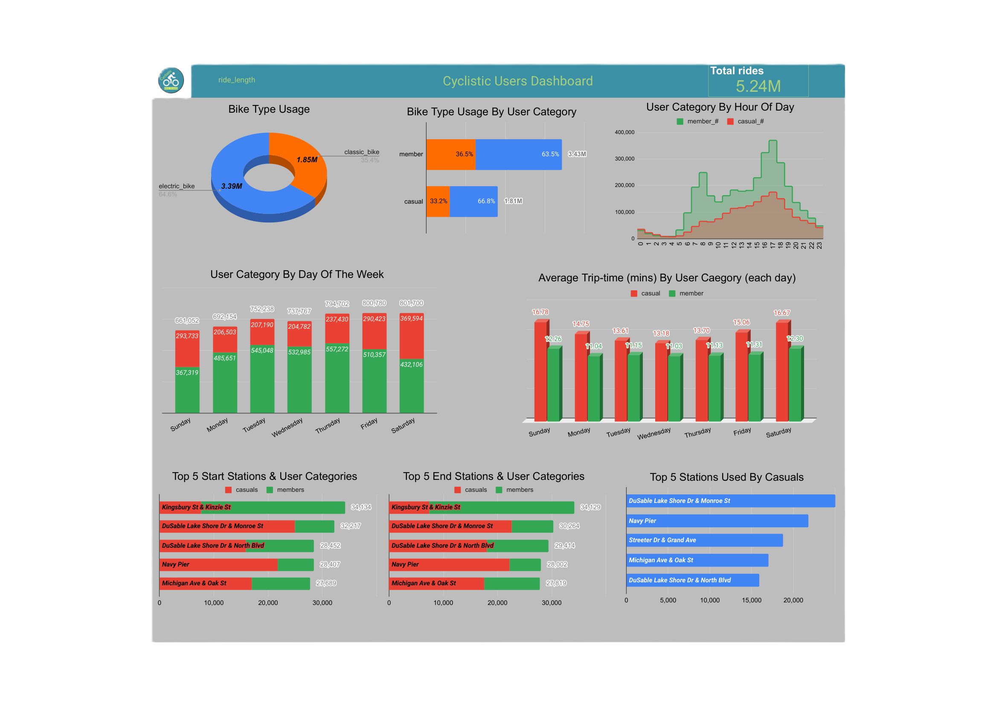

#  Cyclistic Bike-Share Analysis  
### Google Data Analytics Professional Certificate — Capstone Project

---

## 📌 Project Overview

This project is the capstone case study for the Google Data Analytics Professional Certificate. The analysis focuses on Cyclistic, a fictional bike-share company based in Chicago.

The Director of Marketing's primary goal is to **maximize annual membership sales**. To achieve this, the project analyzes 12 months of historical trip data from 2025 to understand the distinct ways that `casual riders` (single-ride or full-day pass users) and `annual members` use the bikes.

We aim to use these behavioural differences to design a data-driven marketing strategy that **converts casual riders into loyal annual members**.

### Key Data Summary:

- **Dataset:** Cyclistic 2025 historical trip data
- **Time Period:** Full year (12 months)
- **Data Size:** Approximately 5.55 million raw rides, cleaned to **5.24 million rides** (after filtering `ride_length` between 1.5 min and 60 min)
- **Core Question:** What are the key motivations and usage patterns that would persuade a casual rider to purchase an annual membership?

---

## 🛠️ Tools & Technologies

This project utilized a combination of tools for data management, analysis, and visualization:

| Tool | Purpose |
|:-----|:--------|
| **SQL (BigQuery)** | • used for data storage <br> • combining 12 months of data into a single table of ~5.55 million rows using UNION ALL <br> • data preprocessing |
| **Google Connected Sheets** | • employed for data transformation—creating the ride_length field <br> • filtering the data to include only trips between 1.5 minutes and 1 hour <br> --- this resulted in a clean dataset of 5.24 million total rides <br> • exploratory analysis <br> • initial aggregation <br> • data visualizations <br> • generating the final dashboard |
| **Google Docs** | • employed for creating the final professional report |
| **GitHub** | • used for project documentation and version control |

---

## 📂 Repository Structure

```bash
cyclistic_case_study_analytics_project/
├── queries/
|      └── cyclistic_project_query.sql         # All SQL queries performed on the data
├── images/
|      ├── cyclistic_logo.png                  # Company's logo
|      └── dashboard_preview.png               # .png file of the cyclistic_dashboard
├── cyclistic_report.pdf                       # 9-page business analysis report
├── cyclistic_dashboard.pdf                    # Dashboard visualizing key insights
└── README.md                                  # Project overview
```

---

## 🎯 Key Insights

The analysis reveals distinct usage patterns, preferences, and behaviours between **Annual Members and Casual Riders**, offering **targeted opportunities for marketing and service improvements:**

- **Rider Behaviour & Usage Patterns:**
  - **Annual Members** (primarily **work commuters**) exhibit a `bi-modal` usage pattern (morning and evening peaks) concentrated on **weekdays**.
  - **Casual Riders** (primarily **leisure users**) display a `uni-modal` pattern (evening peak) with usage spiking significantly on **weekends** (peak on Saturday).
- **Trip Duration:** `Casual riders` consistently take **longer average trips** across every day of the week compared to `Annual Members`, a likely indicator of **recreational use**.
- **Bike Preference:** Both user groups strongly prefer **electric bikes over classic bikes**, accounting for `64.6%` of total rides.
- **Station Popularity:** _Four of the top five most-used stations_ are predominantly utilized by `Casual Riders`. These locations represent **prime opportunities for targeted marketing** to convert casual riders into annual members.

### Summary Table:

| Feature | Annual Members | Casual Riders |
|:--------|:--------------:|:-------------:|
| **Primary Use** | Work Commuting | Leisure / Recreation |
| **Peak Hours** | Bi-modal (Morning + Evening) | Uni-modal (Evening) |
| **Weekly Pattern** | High on Weekdays | High on Weekends (Peak Saturday) |
| **Avg. Weekly Duration** | Shorter (~11 min) | Consistently Longer (~15 min) |
| **Bike Preference** | 63.5% Electric | 66.8% Electric |
| **Top Stations** | 1 in the Top-5 overall stations | 4/5 of the Top-5 overall stations |

---

## 💡 Business Recommendations

Based on the analysis that `casual riders` are primarily **leisure-focused weekend riders** who take longer trips and prefer electric bikes, the following strategic actions are recommended to drive membership conversion:

1. **Targeted Station Advertising & Geotargeting:** Implement digital and physical advertising at the **top 5 stations** frequented by `casual riders`. The messaging must explicitly highlight the **cost savings and superior value** of an _annual membership_ compared to day passes for their typically long weekend rides.
   
2. **Weekend-Focused Digital Campaigns:** Launch **digital media campaigns** (e.g., Instagram, Facebook, Google Ads) with ad spend heavily weighted toward **Saturdays and Sundays**. Position the _annual membership_ not as a commuter tool, but as the **"Weekend Pass Upgrade"** or **"Leisure Rider's Choice"** to align with their usage patterns.

3. **Electric Bike Incentive Program:** Capitalize on the `casual riders'` strong preference for **e-bikes**. Offer a limited-time digital promotion that **ties membership to electric bike use**, such as free e-bike unlocks or discounted e-bike ride time, as a high-value incentive.

4. **Leisure Content Marketing:** Develop engaging social media and digital content (e.g., curated routes, weekend destination guides, influencer collaborations). This strategy reframes the membership as a **lifestyle and leisure enhancement**, shifting perception away from being solely a commuter product.

5. **Strategic Pricing & Promotions:** Introduce **trial memberships or special introductory discounts** specifically for _frequent casual users_ (e.g., those who rent more than 4-5 times a month) to encourage the initial transition to a commitment.

---

## 📊 Dashboard Preview



### Project Files

**Click to view/download directly in GitHub** (PDFs open in browser):

> 📄 View the detailed analysis, methodology, and findings in – **[Full Report](https://raw.githubusercontent.com/dlhegend/cyclistic_case_study_analytics_project/main/cyclistic_report.pdf)**
> 
> 📈 One-page dashboard visualizing insights – **[Dashboard](https://raw.githubusercontent.com/dlhegend/cyclistic_case_study_analytics_project/main/cyclistic_dashboard.pdf)**

---

*This project was completed as part of the [Google Data Analytics Professional Certificate](https://www.coursera.org/professional-certificates/google-data-analytics) on Coursera.* This project demonstrates end-to-end data analysis from raw data to actionable insights.
